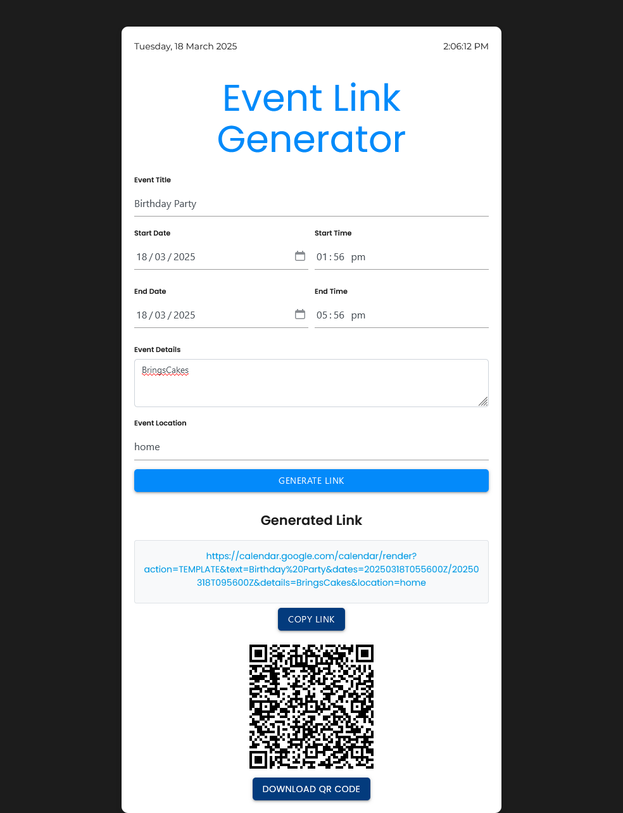

# Calendator: Event Link Generator

Hey there! Welcome to Calendator! 🎉 This awesome web app helps you create Google Calendar event links and QR codes for your events. Just fill in the event details, and Calendator will handle the rest. You can share the link or download the QR code to make it super easy for others to add the event to their calendars.

## Features

- **Event Details:** Enter the event title, start date, start time, end date, end time, details, and location.
- **Generate Link:** Create a Google Calendar event link with a single click.
- **QR Code:** Generate a QR code for the event link.
- **Copy Link:** Easily copy the generated link to your clipboard.
- **Download QR Code:** Download the QR code as an image.
- **Live Clock:** See the current date and time at the top of the page.

## Getting Started

### What You Need

All you need is a web browser that supports HTML5, CSS3, and JavaScript.

### How to Install

1. **Clone the Repository:**
    ```sh
    git clone https://github.com/Anzrikart/calendator.git
    ```

2. **Navigate to the Project Directory:**
    ```sh
    cd calendator_main
    ```

3. **Open the App:**
    Open the `calendator.html` file in your web browser.

## How to Use

1. **Open the App:**
    Open the `calendator.html` file in your web browser.

2. **Fill in the Event Details:**
    Enter the event title, start date, start time, end date, end time, details, and location.

3. **Generate the Link:**
    Click the "Generate Link" button.

4. **View the Link and QR Code:**
    The generated link and QR code will be displayed.

5. **Copy the Link:**
    Click the "Copy Link" button to copy the link to your clipboard.

6. **Download the QR Code:**
    Click the "Download QR Code" button to download the QR code as an image.

## Live Clock

Check out the live clock at the top of the page. It shows the current date and time in AM/PM format.

## Screenshots

Here's a sneak peek of Calendator in action:



## License

This project is licensed under the MIT License. See the [LICENSE](LICENSE) file for details.

## Acknowledgements

- [Bootstrap](https://getbootstrap.com/)
- [Materialize](https://materializecss.com/)
- [Google Fonts](https://fonts.google.com/)
- [QRious](https://github.com/neocotic/qrious)
- [jQuery](https://jquery.com/)
- [Popper.js](https://popper.js.org/)
- [Lottie](https://lottiefiles.com/)

